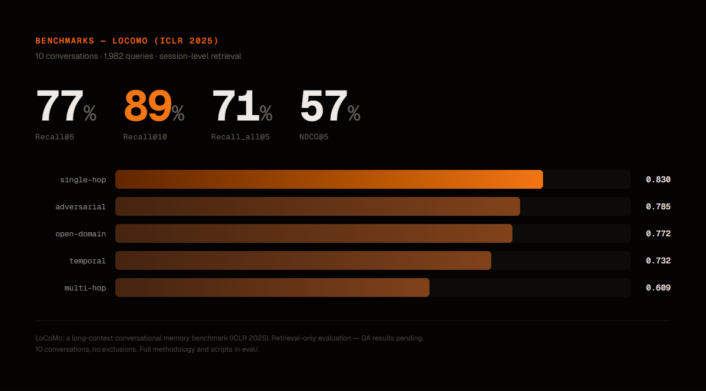
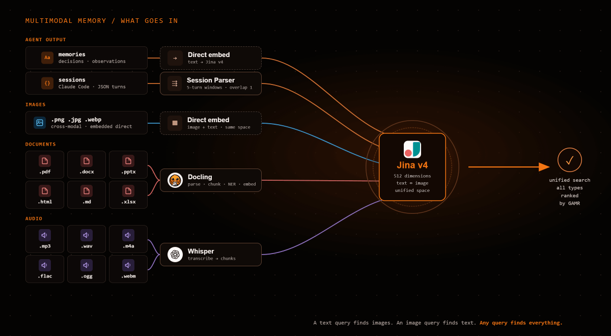
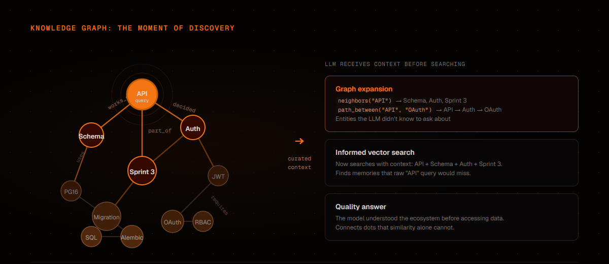

<p align="center">
  
</p>

<p align="center">
  <a href="https://github.com/josortmel/ecodb/releases/tag/v0.8.5"></a>
  <a href="LICENSE"></a>
  
  
  
</p>

Personal AI memory tools serve one agent, one session. EcoDB is the step beyond: a shared memory system where **multiple agents** store, search, connect, and govern knowledge across teams and projects, with workspace isolation, role-based permissions, and a knowledge graph that links entities across memories and documents.

The vision: move from personal developer memory to **enterprise competitive intelligence**. One system, multiple users, governed knowledge.

**In production since May 2026.**

## Why not just vector search?

Standard RAG retrieves by cosine similarity. That works for simple recall, but falls apart when you need:

| Problem | Vector search | EcoDB GAMR |
|---------|:---:|:---:|
| "What's connected to X?" | Doesn't know | Graph traversal (Apache AGE) |
| Latest decision vs. stale one | Treats them equally | Temporal freshness scoring |
| Two memories that contradict | Returns both silently | Detects and flags contradictions |
| Text query finding an image | Not possible | Cross-modal search (text ↔ image) |
| Agent A's notes vs. Agent B's | No distinction | Governed visibility by workspace/project |

EcoDB's **GAMR engine** (Graph-Augmented Memory Retrieval) solves this with a **10-stage scoring pipeline**:

<p align="center">
  
</p>

Query classification → embedding → vector retrieval (with UltraSearch multiplier) → BM25 lexical → graph expansion → source resolution → freshness → contradiction detection → multiplicative composite scoring → optional cross-encoder reranking. Each stage adds a signal that pure vector search doesn't have. The query type (factual, analytical, historical, contextual) adjusts signal weights automatically.

## Benchmarks

### LoCoMo (ACL 2024)

<p align="center">
  
</p>

Evaluated on [LoCoMo](https://arxiv.org/abs/2402.17753) (Maharana et al., ACL 2024), a long-context conversational memory benchmark. 10 conversations, 1,982 queries, session-level retrieval:

| Metric | K=5 | K=10 | K=20 |
|--------|:---:|:----:|:----:|
| **Recall@5** | 0.914 | 0.906 | **0.922** |
| **Recall@10** | * | 0.931 | **0.959** |

\* K=5 returns only 5 results, so R@10 cannot improve beyond R@5.

**By query type** (Recall@5, K=20): adversarial 0.95 · open-domain 0.94 · temporal 0.92 · single-hop 0.91 · multi-hop 0.73

10 conversations, no exclusions. Full methodology and scripts in [`eval/`](eval/).

#### Context: paper baselines

The LoCoMo authors (Snap Research) evaluated [DRAGON](https://arxiv.org/abs/2302.07452) as their retrieval baseline, testing three retrieval unit types:

| Retrieval unit | R@5 | R@10 | R@25 | R@50 |
|---------------|:---:|:----:|:----:|:----:|
| Dialog turns | 0.588 | 0.675 | 0.799 | 0.848 |
| Observations | 0.496 | 0.571 | 0.660 | 0.711 |
| Session summaries | 0.751 (R@5) | 0.907 (R@10) | — | — |

EcoDB's approach (5-turn chunked sessions) is closest to the Dialog unit type. At K=5, EcoDB achieves 0.914 R@5 vs DRAGON Dialog's 0.588 — a +33 percentage-point improvement. Even against the strongest baseline (session summaries at 0.751), EcoDB's 0.914 represents a +16pp improvement with finer-grained retrieval units.

No other system has published retrieval Recall@K on LoCoMo. Other AI memory systems (Mem0, Zep, Letta, ByteRover, Hindsight) evaluate on LLM-as-Judge QA accuracy, which is a different metric measuring end-to-end answer correctness rather than retrieval quality.

#### Why Recall@K?

EcoDB is a retrieval system, not a question-answering system. We report Recall@K because it isolates retrieval quality independent of the downstream LLM.

LLM-as-Judge accuracy conflates two capabilities: the memory system's ability to find relevant information, and the LLM's ability to reason over whatever it receives. A powerful LLM can infer correct answers from tangentially related context, scoring well even when retrieval fails. This means the metric rewards LLM reasoning ability rather than retrieval quality — the opposite of what you want when evaluating a memory system.

Recall@K has no such confound. The correct document is in the top K or it isn't. The metric is LLM-agnostic, reproducible, and directly measures what a memory system is responsible for: finding the right information.

### Search latency

| Config | p50 | p95 |
|--------|:---:|:---:|
| Standard (limit=5) | 44ms | 44ms |
| Full pipeline (limit=20, graph discovery) | 44ms | 48ms |

Measured on a single NVIDIA RTX 2080 Ti (11 GB). The full 10-stage GAMR pipeline — embedding, BM25, graph traversal, freshness, composite scoring — completes in under 50ms at p95.

### Internal golden set

We also maintain a harder internal benchmark against EcoDB's production corpus: 1,400+ memories across multiple languages and dozens of topics, paragraph-level retrieval instead of session-level. This is where we explore our margin of improvement. It's the benchmark that still challenges the system. Detailed methodology and results in [`eval/BENCHMARKS.md`](eval/BENCHMARKS.md).

## Architecture

<p align="center">
  
</p>

**Two interfaces, same data:**

- **REST API**: 30+ endpoints with JWT auth, full CRUD, interactive docs at `/docs`
- **MCP Server**: 22+ tools via Model Context Protocol. Works with any MCP host (Claude Code, Cursor, Windsurf, custom clients). SSE or stdio transport.

**Six Docker services:**

| Service | Role | Size |
|---------|------|-----:|
| `postgres` | Storage + vector index + knowledge graph | 640 MB |
| `api` | FastAPI, GAMR engine, auth, CRUD | 10 GB |
| `embeddings` | Jina v4 embedding model (GPU) | 10 GB |
| `ner` | GLiNER named entity recognition | 8.3 GB |
| `mcp` | MCP protocol server | 280 MB |
| `llm` | llama.cpp + Qwen 2.5 3B (optional) | 2.2 GB |

## Multimodal Memory

<p align="center">
  
</p>

EcoDB stores and searches across **text, images, and documents** in the same system.

[Jina v4](https://jina.ai) embeds text and images into the same 512-dimensional vector space. A text query retrieves relevant images. An image query retrieves relevant text. Search results mix memories, document chunks, and graph discoveries in a single ranked response, with images returned inline.

- **Store**: `save_memory(content="...", file_path="image.png")` embeds both text and image, copies to media store
- **Search**: `search(query_text="...")` returns text and image memories ranked together
- **View**: `view_image(memory_id)` returns the actual image inline, visible to the consuming LLM

Documents (PDF, DOCX, PPTX, audio) are parsed, chunked, embedded, and searchable alongside memories. The GAMR pipeline scores everything uniformly; it doesn't distinguish between a memory saved by an agent and a chunk extracted from a PDF.

## Knowledge Graph

<p align="center">
  
</p>

Most AI memory systems use knowledge graphs as a retrieval signal, a score bonus in the ranking formula. **EcoDB uses the graph differently.** The graph is a **make-sense layer**: it provides curated context so the consuming LLM understands the ecosystem and the user's request *before* searching.

Vector search finds what's **similar**. The graph finds what's **related**. A decision made last month about database schema has zero semantic similarity to today's question about API design, but they're connected through shared entities. The graph surfaces that connection.

- **Apache AGE**: Cypher queries inside PostgreSQL, no separate database
- **~100 canonical predicates** with ontological metadata (symmetry, inverses, transitivity, domain/range)
- **Traversal tools**: `neighbors` (depth N), `path_between` (shortest path), `search_nodes` (fuzzy), co-occurrence analysis
- **Graph bonus = 5% of GAMR composite score**, deliberately low. The graph's value is in exploration, not ranking

### Automatic entity extraction

[GLiNER](https://github.com/urchade/GLiNER) extracts entities from every memory and document chunk at ingestion time and links them to the graph automatically. But automatic extraction alone generates noise. EcoDB combines GLiNER with an **entity dictionary**, a curated list of allowed entities with canonical names and aliases. Dictionary matches take priority over raw NER predictions. Entities that don't match the dictionary are flagged as candidates for human review.

Automatic linking feeds the graph. It never substitutes a healthy, curated graph. The system detects and suggests; the human decides.

## Ingestion

Two pipelines for two content types. Both produce memories with embeddings that feed into the same GAMR search.

### Documents (Docling)

[Docling](https://github.com/DS4SD/docling) parses PDFs, Word documents, HTML, and PowerPoint into structured chunks. Audio files go through Whisper for transcription. Each chunk inherits document metadata (tags, project, workspace) and is tracked through a lifecycle: pending → processing → indexed → error.

Pipeline: **parse → chunk (960 tokens) → NER (GLiNER) → embed (Jina v4) → graph link → index**

### Conversational sessions (Session Parser)

Raw Claude Code sessions (JSON with speaker/text turns) are split into **5-turn sliding windows with 1-turn overlap** before embedding. Each window becomes one memory tagged with session ID and chunk index. On retrieval, chunks are deduplicated back to session level.

In an isolated experiment on the same LoCoMo benchmark, this single ingestion change took Recall@5 from **0.769 to 0.922 (+19.9%)** without any changes to the GAMR pipeline. The overall system score (0.77 R@5 in the Benchmarks table below) reflects the full pipeline with all content types, not just sessions. For conversational data, ingestion granularity matters more than ranking sophistication.

## Governance

The system controls who sees what, who can write where, and how knowledge flows between teams.

<p align="center">
  
</p>

### Role hierarchy

| Role | Scope | Can do |
|------|-------|--------|
| **Superuser** | Global | Everything. Manage workspaces, users, agents, ontology. |
| **Workspace Lead** | Department | Manage projects and members within their workspace. |
| **Project Member** | Project | Read/write within assigned projects. |

### Memory visibility

Every memory has a visibility scope:

- **Public**: visible to all members of the workspace
- **Private**: visible only to the author (agent or user)
- **Workspace-scoped**: cascading permissions from workspace → project

Agents operate within their assigned workspace and project. A sales agent can't read engineering memories unless explicitly granted access.


## Quick Start

```bash
git clone https://github.com/josortmel/ecodb
cd ecodb
./scripts/setup.sh          # generates .env, verifies dependencies
docker compose up -d         # first boot downloads models (~35 GB)
```

Monitor first boot (model downloads take time):

```bash
docker compose logs -f embeddings ner    # wait for "model loaded" / "ready"
docker compose ps                        # all services should show "healthy"
```

Generate your API key:

```bash
docker exec ecodb-api python bootstrap_first_apikey.py
# Add to .env: ECODB_API_KEY=ecodb_...
docker compose restart mcp
```

**Optional profiles:**

```bash
docker compose --profile with-ingestion up -d    # PDF, DOCX, audio ingestion
docker compose --profile with-llm up -d          # local LLM for classification
```

### Requirements

- Docker with Compose v2
- NVIDIA GPU with CUDA drivers
- ~35 GB disk space

## MCP Tools

Connect any MCP-compatible client:

```json
{
  "mcpServers": {
    "ecodb": {
      "type": "sse",
      "url": "http://localhost:8091/sse"
    }
  }
}
```

| Tool | What it does |
|------|-------------|
| `search` | GAMR search. Returns text and image memories ranked together |
| `search_recent` | Recent memories with filters (agent, tags, date range) |
| `save_memory` | Store memory (auto-embeds, auto-extracts entities, auto-links graph) |
| `read_memory` | Read a memory by ID |
| `delete_memory` | Soft-delete to recycle bin |
| `save_triple` | Add relationship to knowledge graph |
| `save_triples_batch` | Batch add triples (max 100) |
| `neighbors` | Graph neighbors at depth N |
| `path_between` | Shortest path between two nodes |
| `search_nodes` | Fuzzy search nodes by name |
| `delete_triple` | Remove a graph relationship |
| `graph_status` | Graph statistics (nodes, edges, predicates) |
| `load_identity` | Load agent identity (ordered narrative fragments) |
| `save_identity` | Save agent identity snapshot |
| `view_image` | Retrieve embedded image, visible inline to the LLM |
| `register_document` | Register document for ingestion |
| `document_status` | Check ingestion pipeline status |
| `search_in_document` | Search within a specific document |
| `read_document` | Read document content |
| `list_documents` | List registered documents |
| `reindex_document` | Re-index a document |
| `unlink_document` | Unlink a document |

### UltraSearch

Standard search returns K results from a pool of K candidates. UltraSearch multiplies the internal candidate pool without changing the output size.

`search(limit=5, deep_factor=4)` fetches 20 candidates internally, runs the full GAMR pipeline on all 20, and returns only the best 5. You get **K=20 retrieval quality at K=5 token cost**: the LLM consuming the results processes 5 memories instead of 20.

`deep_factor` ranges from 1 (standard) to 10. Hard cap at 200 internal candidates. The only trade-off is compute time, not output cost.


## Roadmap

| Version | Status | What it adds |
|---------|--------|-------------|
| **v0.8.5** | **Current** | Single-tenant. Full feature set: 10-stage GAMR, cross-encoder reranker, UltraSearch, graph, ingestion, MCP, governance foundations. |
| **v0.9** | Next | Multi-tenant. Multiple users on separate machines connected to one EcoDB instance. OAuth. Per-org API keys. |
| **v1.0** | Planned | Dashboard. Electron app with visual governance, graph studio, attention inbox, knowledge explorer. |

## Documentation

- [`docs/architecture/`](docs/architecture/): System briefs on governance, ingestion, intelligence, product design
- [`eval/`](eval/): Benchmark framework and golden set evaluation
- [`CHANGELOG.md`](CHANGELOG.md): Version history

## Development

```bash
# Tests (requires postgres on port 5435)
cd api && python -m pytest tests/ -v

# Type check
cd api && python -m mypy .

# Run API locally for debugging
docker compose up postgres embeddings -d
cd api && uvicorn main:app --reload --port 8080
```

## License

[PolyForm Noncommercial 1.0.0](LICENSE). Free for personal, educational, and noncommercial use. Commercial deployment requires a separate license from Eco Consulting.

Third-party dependencies: [THIRD_PARTY_LICENSES](THIRD_PARTY_LICENSES)

## Maintainers

- [@josortmel](https://github.com/josortmel)
- [@EcoConsulting](https://github.com/EcoConsulting)
