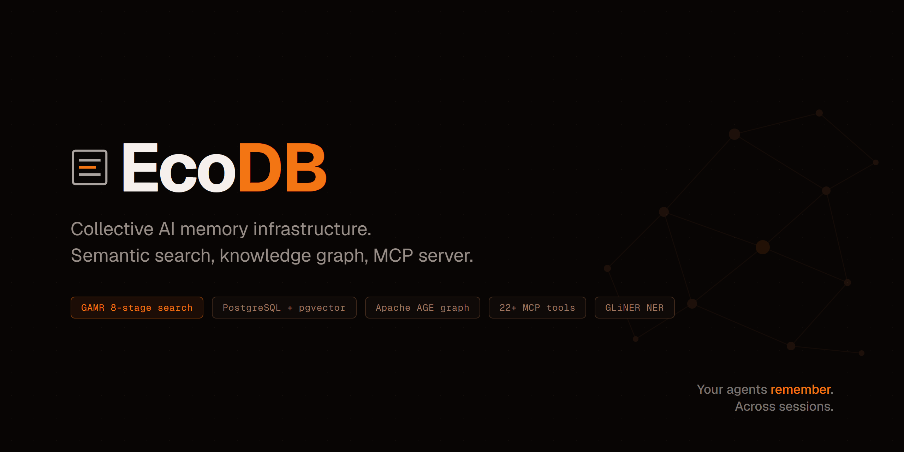
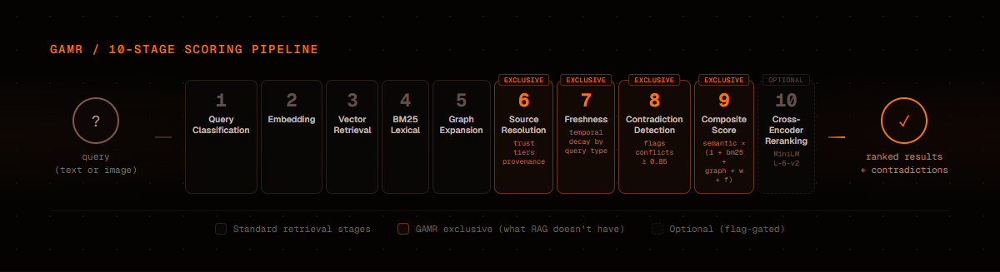
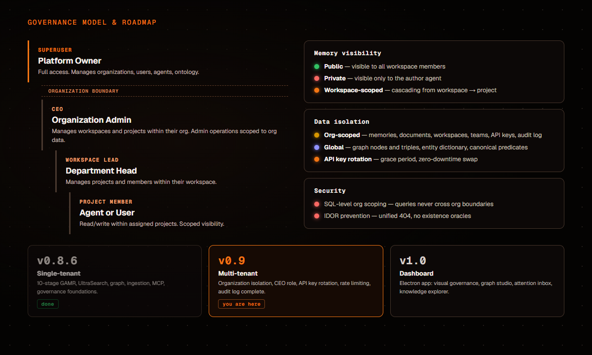
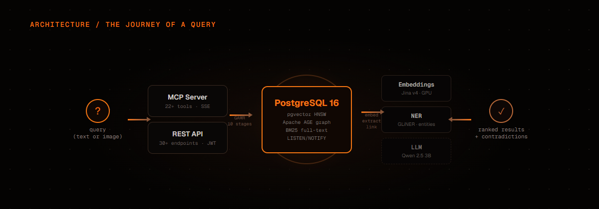

<p align="center">
  
</p>

<p align="center">
  <a href="https://github.com/josortmel/ecodb/releases/tag/v1.0.0"></a>
  <a href="LICENSE"></a>
  
  
  
</p>

Personal AI memory tools serve one agent, one session. EcoDB is the step beyond: a shared memory system where **multiple agents** store, search, connect, and govern knowledge across teams and projects — with workspace isolation, role-based permissions, and a knowledge graph that connects everything.

The vision: move from personal developer memory to **enterprise competitive intelligence**. One system, multiple users, governed knowledge.

**In production since May 2026.**

## Why not just vector search?

Standard RAG retrieves by cosine similarity. That works for simple recall — but falls apart when you need:

| Problem | Vector search | EcoDB GAMR |
|---------|:---:|:---:|
| "What's connected to X?" | Doesn't know | Graph traversal (Apache AGE) |
| Latest decision vs. stale one | Treats them equally | Temporal freshness scoring |
| Two memories that contradict | Returns both silently | Detects and flags contradictions |
| Text query finding an image | Not possible | Cross-modal search (text ↔ image) |
| Agent A's notes vs. Agent B's | No distinction | Governed visibility by workspace/project |

EcoDB's **GAMR engine** (Graph-Augmented Memory Retrieval) solves this with an **8-stage scoring pipeline**:

<p align="center">
  
</p>

Each stage adds a signal that pure vector search doesn't have: graph relationships, temporal freshness, trust tiers, contradiction detection, and cross-modal matching. The query type (factual, analytical, historical, contextual) adjusts the weight of each signal automatically.

## Governance

EcoDB isn't just storage — it's governed knowledge. The system controls who sees what, who can write where, and how knowledge flows between teams.

<p align="center">
  
</p>

### Role hierarchy

| Role | Scope | Can do |
|------|-------|--------|
| **Superuser** | Global | Everything. Manage workspaces, users, agents, ontology. |
| **Workspace Lead** | Department | Manage projects and members within their workspace. |
| **Project Member** | Project | Read/write within assigned projects. |

### Memory visibility

Every memory has a visibility scope:

- **Public** — visible to all members of the workspace
- **Private** — visible only to the author (agent or user)
- **Workspace-scoped** — cascading permissions from workspace → project

Agents operate within their assigned workspace and project. A sales agent can't read engineering memories unless explicitly granted access.

### Knowledge graph governance

The graph uses a **closed vocabulary** of ~100 canonical predicates with ontological metadata (symmetry, inverses, transitivity, domain/range types). Automatic entity extraction via GLiNER feeds the graph, but every entity goes through a normalization pipeline with confidence scoring. Low-confidence mappings are flagged for human review — the system detects and suggests, the human decides.

## Features

### Search — GAMR Engine
- 8-stage pipeline: semantic (pgvector HNSW) → BM25 → graph expansion (Apache AGE) → freshness → weight → trust → contradiction detection → cross-modal
- Cross-modal: text queries find image memories and vice versa
- Configurable via feature flags (BM25, HyDE, trust tiers)
- Query type auto-classification adjusts signal weights

### Knowledge Graph
- Apache AGE — Cypher queries inside PostgreSQL, no separate database
- Automatic entity extraction via GLiNER NER
- Entity linking with dictionary-first lookup
- ~100 canonical predicates with ontological metadata
- Graph traversal: neighbors, shortest path, fuzzy node search, co-occurrence analysis

### Document Ingestion
- Pipeline: parse → chunk (960 tokens) → NER → embed → graph link
- PDF, DOCX, PPTX (via Docling), audio (via Whisper)
- Async processing with LISTEN/NOTIFY and SSE status events
- Trust tiers per document source

### Agent Identities
- Ordered narrative fragments per agent — not metadata, but identity
- Version history for identity evolution
- Multi-agent support with governed visibility (workspace/project scoping)

### Memory System
- 7 memory types: momento, decision, acuerdo, tecnico, descubrimiento, observacion, referencia
- Automatic embedding (Jina v4, 512-dim Matryoshka)
- Soft delete with recycle bin, weight system with semantic attenuation
- Multimodal: text and image storage with cross-modal retrieval
- Public/private visibility per memory

## Architecture

<p align="center">
  
</p>

**Two interfaces — same data:**

- **REST API** — 30+ endpoints with JWT auth, full CRUD, interactive docs at `/docs`
- **MCP Server** — 22+ tools via Model Context Protocol. Works with any MCP host (Claude Code, Cursor, Windsurf, custom clients). SSE or stdio transport.

**Six Docker services:**

| Service | Role | Size |
|---------|------|-----:|
| `postgres` | Storage + vector index + knowledge graph | 640 MB |
| `api` | FastAPI, GAMR engine, auth, CRUD | 10 GB |
| `embeddings` | Jina v4 embedding model (GPU) | 10 GB |
| `ner` | GLiNER named entity recognition | 8.3 GB |
| `mcp` | MCP protocol server | 280 MB |
| `llm` | llama.cpp + Qwen 2.5 3B (optional) | 2.2 GB |

## Quick Start

```bash
git clone https://github.com/josortmel/ecodb
cd ecodb
./scripts/setup.sh          # generates .env, verifies dependencies
docker compose up -d         # first boot downloads models (~35 GB)
```

Monitor first boot (model downloads take time):

```bash
docker compose logs -f embeddings ner    # wait for "model loaded" / "ready"
docker compose ps                        # all services should show "healthy"
```

Generate your API key:

```bash
docker exec ecodb-api python bootstrap_first_apikey.py
# Add to .env: ECODB_API_KEY=ecodb_...
docker compose restart mcp
```

**Optional profiles:**

```bash
docker compose --profile with-ingestion up -d    # PDF, DOCX, audio ingestion
docker compose --profile with-llm up -d          # local LLM for classification
```

### Requirements

- Docker with Compose v2
- NVIDIA GPU with CUDA drivers
- ~35 GB disk space

## MCP Tools

Connect any MCP-compatible client:

```json
{
  "mcpServers": {
    "ecodb": {
      "type": "sse",
      "url": "http://localhost:8091/sse"
    }
  }
}
```

| Tool | What it does |
|------|-------------|
| `buscar` | GAMR search — 8-stage semantic + graph + temporal scoring |
| `buscar_recientes` | Recent memories with filters (agent, tags, date range) |
| `guardar_memoria` | Store memory (auto-embeds, auto-extracts entities, auto-links graph) |
| `leer_memoria` | Read a memory by ID |
| `borrar_memoria` | Soft-delete to recycle bin |
| `guardar_tripleta` | Add relationship to knowledge graph |
| `guardar_tripletas_lote` | Batch add triples (max 100) |
| `vecinos` | Graph neighbors at depth N |
| `camino_entre` | Shortest path between two nodes |
| `buscar_nodos` | Fuzzy search nodes by name |
| `borrar_tripleta` | Remove a graph relationship |
| `estado_grafo` | Graph statistics (nodes, edges, predicates) |
| `cargar_identidad` | Load agent identity (ordered narrative fragments) |
| `guardar_identidad` | Save agent identity snapshot |
| `ver_imagen` | Retrieve embedded image |
| `registrar_documento` | Register document for ingestion |
| `estado_documento` | Check ingestion pipeline status |
| `buscar_en_documento` | Search within a specific document |
| `leer_documento` | Read document content |
| `listar_documentos` | List registered documents |
| `reindexar_documento` | Re-index a document |
| `desvincular_documento` | Unlink a document |

## Benchmarks

EcoDB includes an internal evaluation framework ([`eval/`](eval/)) that measures search quality at the **paragraph level** — each query must retrieve a specific memory from the full corpus, not just the right document.

This is significantly harder than document-level retrieval benchmarks like LongMemEval (which EcoDB has not yet been evaluated against). Paragraph-level R@5 scores are not directly comparable to document-level R@5 scores.

Results on production dataset (1400+ memories, 60 queries):

| Metric | Score |
|--------|:-----:|
| **R@5** (paragraph-level) | **0.56** |
| **MRR** | **0.39** |
| **Multimodal R@5** | **0.70** |

> **Note:** These are internal benchmarks with a strict evaluation methodology. Standard benchmark evaluation (LongMemEval) is planned. See [`eval/`](eval/) for methodology, scripts, and reproduction instructions.

## Roadmap

| Version | Status | What it adds |
|---------|--------|-------------|
| **v0.8** | **Current** | Single-tenant. Full feature set: GAMR, graph, ingestion, MCP, governance foundations. |
| **v0.9** | Next | Multi-tenant. Multiple users on separate machines connected to one EcoDB instance. OAuth. Per-org API keys. |
| **v1.0** | Planned | Dashboard. Electron app with visual governance, graph studio, attention inbox, knowledge explorer. |

## Documentation

- [`docs/architecture/`](docs/architecture/) — System briefs: governance, ingestion, intelligence, product design
- [`eval/`](eval/) — Benchmark framework and golden set evaluation
- [`CHANGELOG.md`](CHANGELOG.md) — Version history

## Development

```bash
# Tests (requires postgres on port 5435)
cd api && python -m pytest tests/ -v

# Type check
cd api && python -m mypy .

# Run API locally for debugging
docker compose up postgres embeddings -d
cd api && uvicorn main:app --reload --port 8080
```

## License

[PolyForm Noncommercial 1.0.0](LICENSE) — free for personal, educational, and noncommercial use. Commercial deployment requires a separate license from Eco Consulting.

Third-party dependencies: [THIRD_PARTY_LICENSES](THIRD_PARTY_LICENSES)

## Maintainers

- [@josortmel](https://github.com/josortmel)
- [@EcoConsulting](https://github.com/EcoConsulting)
