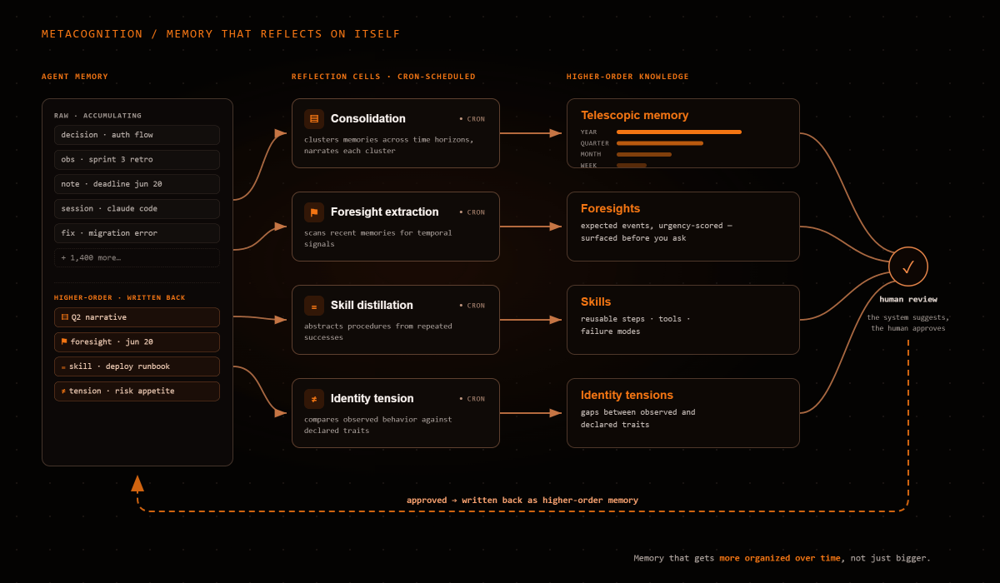

<p align="center">
  
</p>

<p align="center">
  <a href="https://github.com/josortmel/EcoDB/releases/latest"></a>
  <a href="LICENSE"></a>
  
  
  
  
  
</p>

<p align="center">
  
</p>

Personal AI memory tools serve one agent, one session. EcoDB extends this to teams: a shared memory system where **multiple agents** store, search, connect, and govern knowledge across projects, with workspace isolation, role-based permissions, and a knowledge graph that links entities across memories and documents.

The vision: move from personal developer memory to **enterprise competitive intelligence**. One system, multiple users, governed knowledge.

**In production since May 2026.**

## Why not just vector search?

Standard RAG retrieves by cosine similarity. That works for simple recall, but falls apart when you need:

| Problem | Vector search | EcoDB GAMR |
|---------|:---:|:---:|
| "What's connected to X?" | Doesn't know | Graph traversal (Apache AGE) |
| Latest decision vs. stale one | Treats them equally | Temporal freshness scoring |
| Two memories that contradict | Returns both silently | Detects and flags contradictions |
| Text query finding an image | Not possible | Cross-modal search (text ↔ image) |
| Agent A's notes vs. Agent B's | No distinction | Governed visibility by workspace/project |

## Multimodal Memory

<p align="center">
  
</p>

EcoDB stores and searches across **text, images, and documents** in the same system.

[Jina v4](https://jina.ai) embeds text and images into the same 512-dimensional vector space. A text query retrieves relevant images. An image query retrieves relevant text. Search results mix memories, document chunks, and graph discoveries in a single ranked response, with images returned inline.

- **Store**: `save_memory(content="...", file_path="image.png")` embeds both text and image, copies to media store
- **Search**: `search(query_text="...")` returns text and image memories ranked together
- **View**: `view_image(memory_id)` returns the actual image inline, visible to the consuming LLM

Documents (PDF, DOCX, PPTX, audio) are parsed, chunked, embedded, and searchable alongside memories. The GAMR pipeline scores everything uniformly; it doesn't distinguish between a memory saved by an agent and a chunk extracted from a PDF.

## Benchmarks

### LoCoMo (ACL 2024)

<p align="center">
  
</p>

Evaluated on [LoCoMo](https://arxiv.org/abs/2402.17753) (Maharana et al., ACL 2024), a long-context conversational memory benchmark. 10 conversations, 1,982 queries, session-level retrieval:

| Metric | K=5 | K=10 | K=20 |
|--------|:---:|:----:|:----:|
| **Recall@5** | 0.914 | 0.906 | **0.922** |
| **Recall@10** | * | 0.931 | **0.959** |

\* K=5 returns only 5 results, so R@10 cannot improve beyond R@5.

**By query type** (Recall@5, K=20): adversarial 0.95 · open-domain 0.94 · temporal 0.92 · single-hop 0.91 · multi-hop 0.73

10 conversations, no exclusions. Full methodology and scripts in [`eval/`](eval/).

#### Why Recall@K?

EcoDB is a retrieval system, not a question-answering system. We report Recall@K because it isolates retrieval quality independent of the downstream LLM.

LLM-as-Judge accuracy conflates two capabilities: the memory system's ability to find relevant information, and the LLM's ability to reason over whatever it receives. A powerful LLM can infer correct answers from tangentially related context, scoring well even when retrieval fails. This means the metric rewards LLM reasoning ability rather than retrieval quality — the opposite of what you want when evaluating a memory system.

Recall@K has no such confound. The correct document is in the top K or it isn't. The metric is LLM-agnostic, reproducible, and directly measures what a memory system is responsible for: finding the right information.

### Search latency

| Config | p50 | p95 |
|--------|:---:|:---:|
| Standard (limit=5) | 44ms | 44ms |
| Full pipeline (limit=20, graph discovery) | 44ms | 48ms |

Measured on a single NVIDIA RTX 2080 Ti (11 GB). The full 10-stage GAMR pipeline completes in under 50ms at p95.

### Internal golden set

We also maintain a harder internal benchmark against EcoDB's production corpus: 1,400+ memories across multiple languages and dozens of topics, paragraph-level retrieval instead of session-level. This is where we explore our margin of improvement. It's the benchmark that still challenges the system. Detailed methodology and results in [`eval/BENCHMARKS.md`](eval/BENCHMARKS.md).

## Dashboard

EcoDB v1.1 ships a **desktop dashboard** (Electron) — visual governance over the entire system. The engine was reachable only through the REST API and MCP tools; now there's a GUI to search, explore, ingest, and govern the knowledge base.

<p align="center">
  
</p>

- **Command Center** — workspace overview: attention inbox, live activity (SSE), knowledge health, ingestion pipeline.
- **Knowledge Explorer** — GAMR search across memories and documents, with author / tag / workspace / project filters, UltraSearch, and document preview.
- **Graph Studio** — the knowledge graph on a canvas: pan, zoom, re-center, expand neighbors, merge entities.
- **Decisions Inbox** — review what the system flagged: stale memories, alias candidates, unconfirmed relations, low-trust documents.
- **Ingestion** — upload documents and watch them flow through the pipeline (pending → indexed) in real time.
- **Ontology Console** — curate the graph's vocabulary: entity dictionary, canonical predicates, alias management (manual scan + merge direction), merges.
- **Memory Agent** — the metacognition surface: schedule the reflection cells, review consolidated clusters, and track foresights, distilled skills, and run telemetry (see [Metacognition](#metacognition)).
- **Settings** — configurable backend URL (connect to a local Docker stack or a remote EcoDB instance on your network), API keys, trust tiers.

Built with React + TypeScript + Tailwind on Electron, talking to the same REST API. The API key never leaves the main process. Windows installer (unsigned — SmartScreen will warn on first run).

## GAMR Engine

EcoDB's **GAMR engine** (Graph-Augmented Multimodal Retrieval) is a **10-stage scoring pipeline**:

<p align="center">
  
</p>

Query classification → embedding → vector retrieval (with UltraSearch multiplier) → BM25 lexical → graph expansion → source resolution → freshness → contradiction detection → multiplicative composite scoring → optional cross-encoder reranking. Each stage adds a signal that pure vector search doesn't have. The query type (factual, analytical, historical, contextual) adjusts signal weights automatically.

### Knowledge Graph

<p align="center">
  
</p>

Most AI memory systems use knowledge graphs as a retrieval signal, a score bonus in the ranking formula. **EcoDB uses the graph differently.** The graph is a **make-sense layer**: it provides curated context so the consuming LLM understands the ecosystem and the user's request *before* searching.

Vector search finds what's **similar**. The graph finds what's **related**. A decision made last month about database schema has zero semantic similarity to today's question about API design, but they're connected through shared entities. The graph surfaces that connection.

- **Apache AGE**: Cypher queries inside PostgreSQL, no separate database
- **~100 canonical predicates** with ontological metadata (symmetry, inverses, transitivity, domain/range)
- **Traversal tools**: `neighbors` (depth N), `path_between` (shortest path), `search_nodes` (fuzzy), co-occurrence analysis
- **Graph bonus = 5% of GAMR composite score**, deliberately low. The graph's value is in exploration, not ranking

#### Automatic entity extraction

[GLiNER](https://github.com/urchade/GLiNER) extracts entities from every memory and document chunk at ingestion time and links them to the graph automatically. But automatic extraction alone generates noise. EcoDB combines GLiNER with an **entity dictionary**, a curated list of allowed entities with canonical names and aliases. Dictionary matches take priority over raw NER predictions. Entities that don't match the dictionary are flagged as candidates for human review.

Automatic linking feeds the graph. It never substitutes a healthy, curated graph. The system detects and suggests; the human decides.

## Metacognition

Most memory systems are passive: they store what you give them and retrieve it on demand. EcoDB also **reflects on its own memory** — on a schedule, without prompting. Background workers ("cells") read the accumulated memories of each agent and write back higher-order knowledge: consolidated narratives, predicted events, distilled skills, and identity tensions.

<p align="center">
  
</p>

Each cell is a cron-scheduled job over one agent's memory:

| Cell | What it does | Produces |
|------|--------------|----------|
| **Consolidation** | Clusters related memories across time horizons (weekly → monthly → quarterly → yearly) and narrates each cluster. Each closed week's thematic clusters are woven into one unified weekly narrative (week rollup), with the themes preserved beneath it for drill-down | Telescopic memory: a zoomable summary of what happened |
| **Foresight extraction** | Scans recent memories for temporal signals (deadlines, scheduled events) above a confidence threshold | Foresights: events the system expects, urgency-scored |
| **Skill distillation** | Finds cases that share a task type with a high success rate and abstracts the procedure | Skills: reusable steps, tools, and failure modes |
| **Identity tension** | Compares how an agent behaves against how it describes itself | Tensions: gaps between observed and declared traits |

The result is a memory that gets **more organized over time, not just bigger**. A year of raw memories collapses into a telescopic narrative; recurring work becomes a named skill; an upcoming deadline surfaces before you ask.

It's all governed and surfaced in the dashboard's **Memory Agent** page:

- **Briefing** — what the system is watching right now: urgency-sorted foresights, open identity tensions, and a telescopic preview.
- **Configs** — schedule and tune the cells per agent (cron builder, model, prompt template), manage LLM providers (keys stored encrypted, never returned in clear).
- **Clusters** — browse, search, and approve the consolidated narratives; drill into members and sources.
- **Foresights** / **Skills** — the full per-agent view of predicted events and distilled procedures.
- **Telemetry** — cell-run history and health: runs, durations, cost, errors.

Nothing runs without a schedule you set, and every consolidation is reviewable before it's trusted. The system distills and suggests; the human approves.

## MCP Tools

Connect any MCP-compatible client (Claude Code, Claude Desktop, Cursor, Windsurf, etc.):

**SSE transport** — for clients that support SSE natively (e.g. Claude Code `settings.json`):
```json
{
  "mcpServers": {
    "ecodb": {
      "type": "sse",
      "url": "http://localhost:8091/sse"
    }
  }
}
```

**stdio transport** — for clients that launch MCP servers as subprocesses (e.g. Claude Desktop `claude_desktop_config.json`):
```json
{
  "mcpServers": {
    "ecodb": {
      "command": "docker",
      "args": ["exec", "-i", "ecodb-mcp", "python", "server.py", "--transport", "stdio"]
    }
  }
}
```

> **Note:** The `--transport stdio` flag is required when using `docker exec` because the MCP container runs in SSE mode by default. Without it, the subprocess tries to bind port 8091 which is already in use by the running container.

| Tool | What it does |
|------|-------------|
| **Memory** | |
| `search` | GAMR search (10-stage). Text and image queries, cross-modal |
| `search_recent` | Recent memories with filters (agent, tags, date range) |
| `get_relevant_context` | Context injection — returns formatted context block for LLM consumption |
| `save_memory` | Store memory with optional image (auto-embeds, auto-extracts entities, auto-links graph) |
| `read_memory` | Read a memory by UUID |
| `delete_memory` | Soft-delete to recycle bin |
| `unarchive_memory` | Restore from recycle bin |
| `view_image` | View image attached to a memory, inline to the LLM |
| **Knowledge Graph** | |
| `save_triple` | Add relationship to knowledge graph |
| `save_triples_batch` | Batch add triples (max 100) |
| `delete_triple` | Remove a graph relationship |
| `neighbors` | Graph neighbors at depth N |
| `path_between` | Shortest path between two nodes |
| `search_nodes` | Fuzzy search nodes by name |
| `graph_status` | Graph statistics (nodes, triples, predicates) |
| **Identity** | |
| `load_identity` | Load agent identity fragments (ordered narrative) |
| `save_identity` | Save agent identity (versioned snapshot) |
| **Documents** | |
| `register_document` | Register document for ingestion (PDF, DOCX, audio) |
| `document_status` | Check document processing status |
| `search_in_document` | Search within a specific document's chunks |
| `read_document` | Read document metadata and chunks |
| `list_documents` | List documents with filters |
| `reindex_document` | Re-queue document for processing |
| `unlink_document` | Soft-delete a document |
| `classify_document` | Set document trust tier (0–3) |
| `confirm_document_relation` | Confirm related document pair |
| **Governance** | |
| `review_alias_candidate` | Approve or reject entity alias candidate |
| `merge_entities` | Soft-merge source entity into target |
| `undo_merge` | Revert a merge operation |
| `seed_dictionary` | Bulk-add entries to entity dictionary |
| `validate_link` | Validate entity↔memory link |
| `get_graph_vocabulary` | Read entity dictionary and approved predicates |
| **Metacognition** | |
| `search_clusters` | Semantic search over fractal memory clusters (cosine + label BM25) |
| `list_clusters` | List an agent's clusters by level / status |
| `read_cluster` | Read a cluster's narrative (+ optional members / sources) |
| `get_telescopic_view` | Load an agent's full fractal memory chain (yearly → weekly + last 3 days) |
| `get_progressive_view` | Progressive-zoom boot: each layer compresses the previous, closed periods are never re-read. One call loads an agent's whole memory (size-annotated for MCP hosts) |
| `fractal_search` | Drill-down navigation: enter at the highest abstraction, zoom by id (quarter → month → week → themes → raw memories), optional semantic ranking per scope |
| `get_briefing` | Agent briefing: foresights + tensions + telescopic summary |
| `narrate_cluster` | Write / update a cluster narrative (owner-only) |

### UltraSearch

Standard search returns K results from a pool of K candidates. UltraSearch multiplies the internal candidate pool without changing the output size.

`search(limit=5, deep_factor=4)` fetches 20 candidates internally, runs the full GAMR pipeline on all 20, and returns only the best 5. You get **K=20 retrieval quality at K=5 token cost**: the LLM consuming the results processes 5 memories instead of 20.

`deep_factor` ranges from 1 (standard) to 10. Hard cap at 200 internal candidates. The only trade-off is compute time, not output cost.

## LangChain Integration

EcoDB ships a first-class LangChain integration. Use it as a **Retriever**, a durable cross-session **Memory**, or a full **agentic toolset** (13 native tools, or 40 via MCP parity) — all backed by the GAMR retrieval engine.

The package lives in the repo at [`ecodb-langchain/`](ecodb-langchain/) and installs from source (not yet on PyPI):

```bash
pip install -e ./ecodb-langchain

# optional extras
pip install -e "./ecodb-langchain[mcp]"      # full 40-tool MCP parity (langchain-mcp-adapters)
pip install -e "./ecodb-langchain[openai]"   # langchain-openai for the agent LLM
```

```python
from ecodb_langchain import EcoDBClient, EcoDBRetriever, make_ecodb_tools

# base_url + api_key also default to env (ECODB_API_URL, ECODB_API_KEY)
client = EcoDBClient(base_url="http://localhost:8080", api_key="ecodb_...")

# 1. As a LangChain Retriever over GAMR search
retriever = EcoDBRetriever(client=client)
docs = retriever.invoke("what did we decide about auth")

# 2. As an agentic toolset (13 native LangChain tools)
tools = make_ecodb_tools(client)
```

| Interface | What it is |
|-----------|-----------|
| `EcoDBClient` | Sync `httpx` client with JWT auth, 1:1 with the MCP surface |
| `EcoDBRetriever` | `BaseRetriever` over GAMR search → `list[Document]` (semantic + graph + temporal) |
| `EcoDBMemory` | Durable cross-session LangChain memory |
| `make_ecodb_tools(client)` | 13 native tools: search, recent, save, graph nav, clusters, telescopic, briefing |
| `build_ecodb_agent()` | Prebuilt LangGraph ReAct agent, model-agnostic |
| `load_ecodb_mcp_tools()` / `build_ecodb_agent_from_mcp()` | Full 40-tool parity via `langchain-mcp-adapters` |

**Requirements:** Python ≥ 3.10, `langchain-core` ≥ 0.3, `httpx` ≥ 0.27. Extras: `[mcp]` needs `langchain-mcp-adapters` ≥ 0.1, `[openai]` needs `langchain-openai` ≥ 0.3.

## Architecture

<p align="center">
  
</p>

**Two interfaces, same data:**

- **REST API**: 30+ endpoints with JWT auth, full CRUD, interactive docs at `/docs`
- **MCP Server**: 40 tools via Model Context Protocol. Works with any MCP host (Claude Code, Cursor, Windsurf, custom clients). SSE or stdio transport.

**Six Docker services:**

| Service | Role | Size |
|---------|------|-----:|
| `postgres` | Storage + vector index + knowledge graph | 640 MB |
| `api` | FastAPI, GAMR engine, auth, CRUD | 10 GB |
| `embeddings` | Jina v4 embedding model (GPU) | 10 GB |
| `ner` | GLiNER named entity recognition | 8.3 GB |
| `mcp` | MCP protocol server | 280 MB |
| `llm` | llama.cpp + Qwen 2.5 3B (optional) | 2.2 GB |

## Ingestion

Two pipelines for two content types. Both produce memories with embeddings that feed into the same GAMR search.

### Documents (Docling)

[Docling](https://github.com/DS4SD/docling) parses PDFs, Word documents, HTML, and PowerPoint into structured chunks. Audio files go through Whisper for transcription. Each chunk inherits document metadata (tags, project, workspace) and is tracked through a lifecycle: pending → processing → indexed → error.

Pipeline: **parse → chunk (960 tokens) → NER (GLiNER) → embed (Jina v4) → graph link → index**

### Conversational sessions (Session Parser)

Raw Claude Code sessions (JSON with speaker/text turns) are split into **5-turn sliding windows with 1-turn overlap** before embedding. Each window becomes one memory tagged with session ID and chunk index. On retrieval, chunks are deduplicated back to session level.

In an isolated experiment on the same LoCoMo benchmark, this single ingestion change took Recall@5 from **0.769 to 0.922 (+19.9%)** without any changes to the GAMR pipeline. The benchmarks above reflect this ingestion strategy applied across the full pipeline. For conversational data, ingestion granularity matters more than ranking sophistication.

## Governance

The system controls who sees what, who can write where, and how knowledge flows between teams.

<p align="center">
  
</p>

### Role hierarchy

| Role | Scope | Can do |
|------|-------|--------|
| **Superuser** | Global | Everything. Manage organizations, users, agents, ontology. |
| **CEO** | Organization | Manage workspaces and projects within their org. Admin operations (entity dictionary, trust tiers, merges) scoped to org data. |
| **Workspace Lead** | Department | Manage projects and members within their workspace. |
| **Project Member** | Project | Read/write within assigned projects. |

### Memory visibility

Every memory has a visibility scope:

- **Public**: visible to all members of the workspace
- **Private**: visible only to the author (agent or user)
- **Workspace-scoped**: cascading permissions from workspace → project

Agents operate within their assigned workspace and project. A sales agent can't read engineering memories unless explicitly granted access.

### Multi-tenancy

EcoDB v0.9 adds organization-level isolation. Multiple teams share one EcoDB instance without seeing each other's data.

The organization is the tenant boundary. Every memory, document, workspace, project, API key, and audit entry belongs to exactly one organization. Queries never return data from another org — scoping is enforced at the SQL level, not application-level filtering. Every JWT carries `organization_id` for all roles, so permission checks need no additional database lookups.

**What's isolated:** memories, documents, workspaces, projects, teams (cross-org membership blocked by database triggers), API keys, audit log.

**What's shared:** graph nodes and triples (structural knowledge like "PostgreSQL is a technology" benefits all orgs), entity dictionary, canonical predicates. The graph is a shared ontology, not tenant data.

**Key capabilities:**

- **API key rotation** — `POST /auth/api-keys/{key_id}/rotate` issues a new key while the old one enters a configurable grace period (default 24h, max 720h). Both keys work simultaneously. Zero-downtime rotation.
- **Rate limiting** — per-user sliding window. 120 req/min general, 60 req/min search. `Retry-After` and `X-RateLimit-*` headers on 429 responses.
- **Audit trail** — every mutation endpoint writes to `audit_log` with `organization_id`. CEOs query their org's audit. Superusers see all.
- **IDOR prevention** — auth before fetch, unified error responses. A 403 never reveals whether a resource exists in another org.

For the complete architecture — authentication flow, data isolation model, admin operations, and design decisions — see [`docs/architecture/multi-tenant.en.md`](docs/architecture/multi-tenant.en.md).

## Quick Start

```bash
git clone https://github.com/josortmel/EcoDB
cd EcoDB
./scripts/setup.sh          # generates .env, verifies dependencies
docker compose up --build -d # first boot builds images + downloads models (~35 GB)
```

On **Windows**, run the setup step with PowerShell instead of `setup.sh`:

```powershell
powershell -ExecutionPolicy Bypass -File scripts\setup.ps1
```

Monitor first boot (model downloads take time):

```bash
docker compose logs -f embeddings ner    # wait for "model loaded" / "ready"
docker compose ps                        # all services should show "healthy"
```

Generate your API key:

```bash
docker exec ecodb-api python bootstrap_first_apikey.py
# Add to .env: ECODB_API_KEY=ecodb_...
docker compose restart mcp
```

**Optional profiles:**

```bash
docker compose --profile with-ingestion up --build -d    # PDF, DOCX, audio ingestion
docker compose --profile with-llm up --build -d          # local LLM for classification
```

### Requirements

- Docker with Compose v2
- NVIDIA GPU with CUDA drivers
- ~35 GB disk space

## Environment Variables

The setup script (`scripts/setup.sh` / `scripts/setup.ps1`) generates `.env` with all required secrets. For production deployments, set these manually:

| Variable | Purpose | Default |
|---|---|---|
| `ECODB_ENV` | Runtime environment (`development`/`production`) | `development` |
| `DATABASE_URL` | PostgreSQL DSN | dev default (`localhost:5435`) |
| `ECODB_JWT_SECRET` | JWT signing secret | dev-only default — refused in production |
| `ECODB_API_KEY_PEPPER` | API key hash pepper | dev-only default — refused in production |
| `ECODB_API_KEY` | API key for MCP server | — generate with `bootstrap_first_apikey.py` |
| `INTERNAL_BROADCAST_SECRET` | Worker → API broadcast auth | no default — generate with `openssl rand -hex 32` |
| `ECODB_CORS_ORIGINS` | Allowed CORS origins | `http://localhost:8080,http://localhost:8091` |
| `HF_CACHE_PATH` | HuggingFace model cache path | named volume `hf_cache` |

> **Production**: `ECODB_ENV=production` activates security validation. The API refuses to start if `ECODB_JWT_SECRET` or `ECODB_API_KEY_PEPPER` are missing, too short (< 16 chars), or at their dev defaults.

> **`INTERNAL_BROADCAST_SECRET`**: required for document ingestion events (`--profile with-ingestion`). Without it, worker SSE events are silently dropped. If upgrading from v1.1.x or earlier, the old public default (`fa8b0c02...`) was shipped in docker-compose — rotate it: `openssl rand -hex 32` → update `.env` → `docker compose restart api worker`.

**Verify schema version after upgrade:**
```bash
docker exec ecodb-postgres psql -U ecodb -d ecodb -c \
  "SELECT version FROM schema_version ORDER BY applied_at DESC LIMIT 1;"
```
Expected: `5.3.0`

## Documentation

- [`docs/architecture/multi-tenant.en.md`](docs/architecture/multi-tenant.en.md): Multi-tenant architecture — isolation model, auth flow, key rotation, rate limiting, design decisions
- [`docs/architecture/`](docs/architecture/): System briefs on governance, ingestion, intelligence, product design
- [`docs/migration-v0.8-to-v0.9.md`](docs/migration-v0.8-to-v0.9.md): Migration guide from v0.8.x to v0.9.0
- [`eval/`](eval/): Benchmark framework, paper baseline comparison, and golden set evaluation
- [`CHANGELOG.md`](CHANGELOG.md): Version history

## Development

```bash
# Tests (requires postgres on port 5435)
cd api && python -m pytest tests/ -v

# Type check
cd api && python -m mypy .

# Run API locally for debugging
docker compose up postgres embeddings -d
cd api && uvicorn main:app --reload --port 8080
```

## License

[PolyForm Noncommercial 1.0.0](LICENSE). Free for personal, educational, and noncommercial use. Commercial deployment requires a separate license from Eco Consulting.

Third-party dependencies: [THIRD_PARTY_LICENSES](THIRD_PARTY_LICENSES)

## Maintainers

- [@josortmel](https://github.com/josortmel)
- [@EcoConsulting](https://github.com/EcoConsulting)
